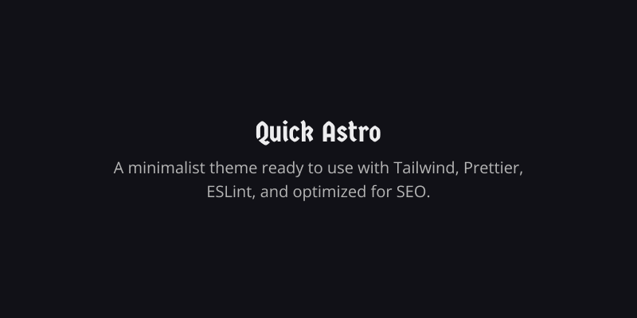

<div align="center">
  
</div>

## 🚀 Quick Astro

This template comes preconfigured with commonly used tools in web development.
With minimal styling, SEO support, sitemap integration, and ViewTransition, it
also includes automated workflows for linting, formatting, and Git hooks, along
with testing setups using Vitest and end-to-end testing with Playwright, making
it a solid and efficient starting point.

### ⚒️ Usage

You can bootstrap a new Astro project using this template with the following
command:

```sh
pnpm dlx create-astro --template roblesdotdev/quick-astro
```

### 💪 Features

- ✅ Minimal styling with tailwind
- ✅ SEO-friendly with canonical URLs and OpenGraph data
- ✅ Sitemap support
- ✅ ViewTransition
- ✅ Linting
- ✅ Formatting
- ✅ Git hooks
- ✅ Vitest
- ✅ Playwright

### 🧞 Commands

All commands are run from the root of the project, from a terminal:

| Command             | Action                                                                         |
| :------------------ | :----------------------------------------------------------------------------- |
| `pnpm install`      | Installs dependencies                                                          |
| `pnpm dev`          | Starts local dev server at `localhost:4321`                                    |
| `pnpm build`        | Build your production site to `./dist/`                                        |
| `pnpm preview`      | Preview your build locally, before deploying                                   |
| `pnpm check`        | Run CLI commands `astro check` and `tsc`                                       |
| `pnpm format`       | Check format without applies changes                                           |
| `pnpm format:write` | Format files and applies fixes                                                 |
| `pnpm lint`         | Run eslint                                                                     |
| `pnpm test`         | Vitest on dev mode(watch)                                                      |
| `pnpm test:run`     | Vitest on CI mode                                                              |
| `pnpm test:e2e`     | Run playwright dev mode                                                        |
| `pnpm test:ci`      | Run playwright on CI mode                                                      |
| `pnpm validate`     | Executes on parallel CLI commands like format, check... Executed before commit |
